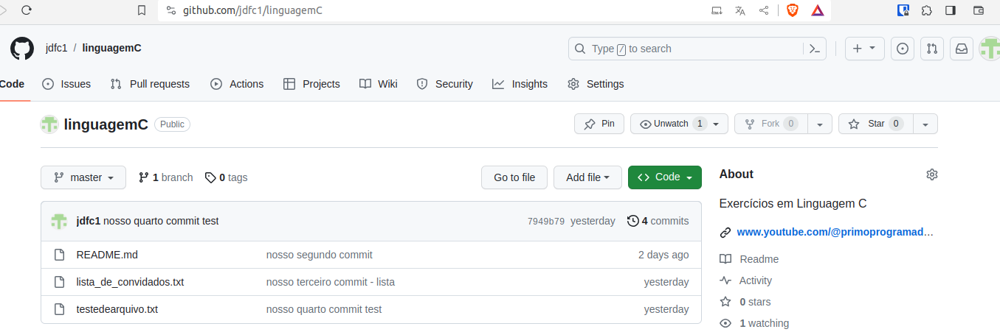
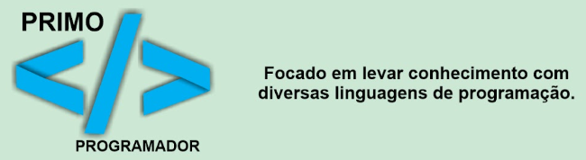

## Desafio Curso Controle de Versão Git - Canal do Youtube / Primo Programador

### Objetivo:

Demonstrar inteligência, organização e melhorias no código. Ao mesmo tempo você pode aprender linguagemC e também aprende comandos Git e GitHub de uma forma simples e divertida.

### Entrega:

1. Entre nesse respositório https://github.com/jdfc1/linguagemC

2. Inscreva-se no meu canal do youtube. Se já não for inscrito.

3. Efetue o Fork do repositório para o seu Github.

4. Crie um branch com o nome do seu canal do youtube. (exemplo: primoprogramador)

5. Modifique algum código, que você acha que poderia ser melhor do que o atual. (Qualquer arquivo) 

6. Faça push da sua branch (que esta com o seu nome) para seu projeto no GitHub. 

7. Abra um Pull Request no GitHub.

8. Comente o que você fez no código e porque esta fazendo isso. E opicionalmente continue commitando.

9. O proprietário do projeto faz merge ou fecha o Pull Request. (O proprietário não é obrigado a aceitar seu envio.)

#### Sites para ajudar em pesquisas.

[[Site externo]](https://www.solumaths.com/pt/calculadora/calcular/fatorial/5)
